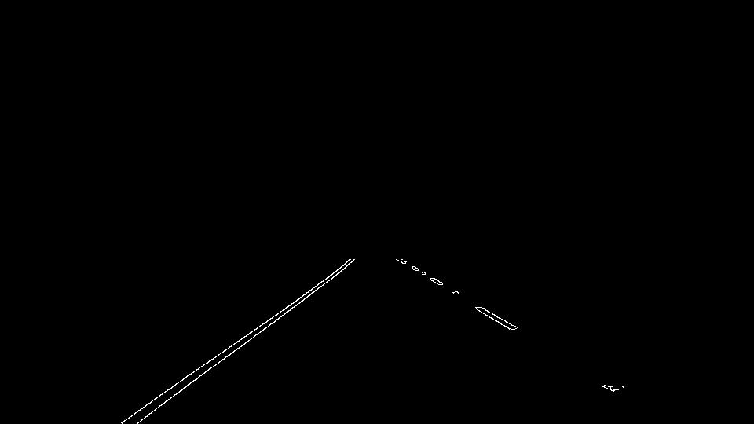

# **Finding Lane Lines on the Road** 

Jupyter notebook file containing a pipeline that identifies lane lines on road images and / or road videos.

---

## Pipeline Description

The pipline defined in function `lane_detection()` constructs segmented lane lines in six steps.

1. Image is converted to grayscale.

   

2. A Gaussian blur is applied to the grayscale image.

   

3. Canny Edge detection algorithm is applied to the blurred image.

   

4. Masking the "Canny" image to only display the relevant edges that correspond to road lines.

   

5. Hough Transform algorithm to find lane lines from the edges is applied to the masked image.

   

6. The lane lines are drawn onto the original image.

   

---

The function `lane_detection_store()` can be used to apply the above pipeline to a series of images stored in a folder. For each pipeline step, the processed images are stored in a folder specified by the user.

---

Aditionally the segmented lane lines can be extrapolated by calling the function `extrapolate()` to draw a solid line on each road side.

This function takes as input a masked image and returns an image with solid lane lines drawn on a black image. The following steps are applied:

- Seperating all lines from the masked image into right-hand and left-hand lines by determining the slope of each line. 

  Negative slope ---> right-hand line // positive slope ---> left-hand line

- Seperating the x and y coordinates for each of the right-hand and left-hand lines.

- Fitting a line with polynominal of degree one through the points. One line through the coordinates that correspond to the right-hand lines and one line through the coordinates that correspond to the left-hand lines.

- Calculating the points for extrapolation based on the equation for a straight line:  $y=mx+b$.

- Draw the extrapolated lines on a black image with the same dimensions as the input image

## Limitations

This is a simple pipeline that does the job for basic roadline detection under ideal lightning conditions and on straight roads.

Shadows and or curvy roads will significantly impact the pipelines performance and lead to wrong results -> see last video included in the notebook. Also lane markings drawn on the road (e.g. arrows) may confuse the detector.

## Improvements

Ways to improve the lane dectector might be to measure the curvature in the images, adjust for changing lightning conditions or use a Convolutional Neural Network to train the lane detector in finding the lines.